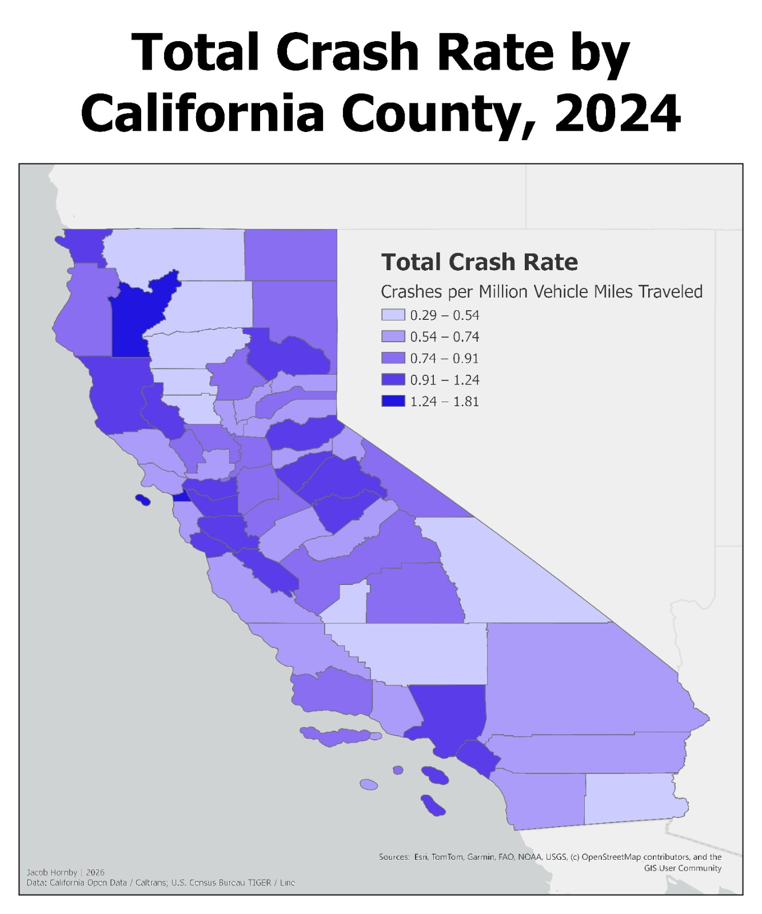
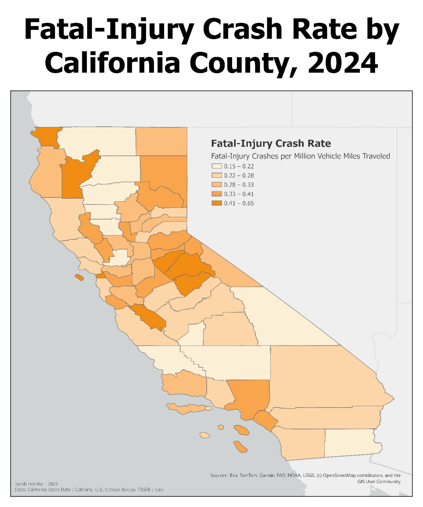
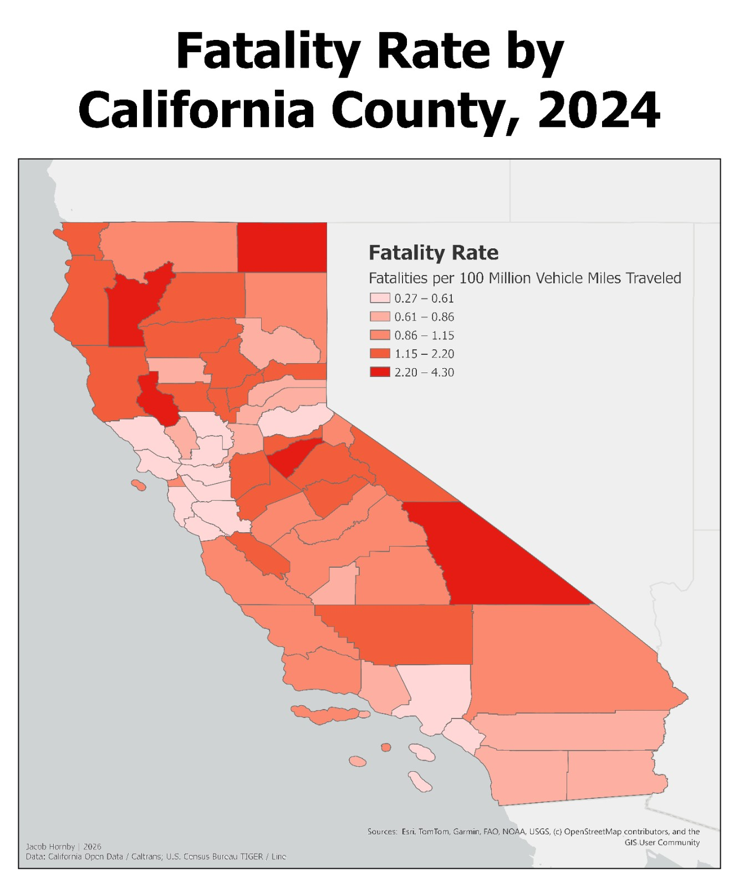
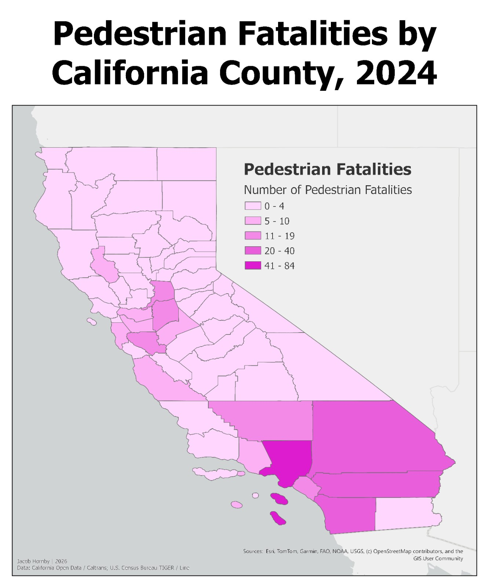
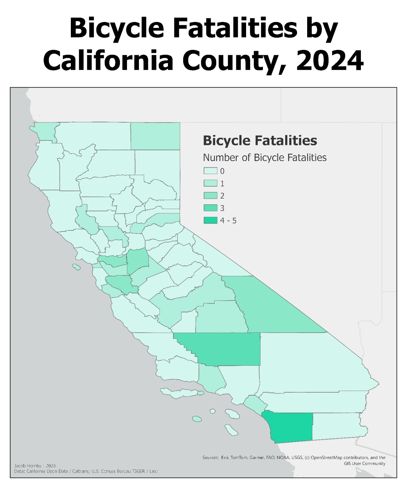

```{r setup, include = FALSE}
knitr::opts_chunk$set(
  echo = FALSE,
  warning = FALSE,
  message = FALSE,
  fig.align = "center",
  out.width = "95%"
)

library(knitr)
library(tidyverse)

format_table = function(df) {
  df |>
    mutate(
      across(
        any_of(c(
          "TOTAL_CRASH_RATE",
          "FATAL_INJURY_CRASH_RATE",
          "FATALITY_RATE"
        )),
        ~ sprintf("%.3f", .x)
      ),
      across(
        any_of("TRAVEL_MVM"),
        ~ scales::comma(.x, accuracy = 0.1)
      ),
      across(
        any_of(c(
          "TOTAL_CRASHES",
          "PDO_CRASHES",
          "INJURY_CRASHES",
          "FATAL_CRASHES",
          "VICTIM_KILLED",
          "VICTIM_INJURED",
          "BICYCLE_FATALITIES",
          "BICYCLE_INJURIES",
          "PEDESTRIAN_FATALITIES",
          "PEDESTRIAN_INJURIES"
        )),
        ~ scales::comma(.x, accuracy = 1)
      )
    )
}
```

\newpage

# Introduction

California's 58 counties experience very different levels of highway traffic. Because of this, raw crash totals do not always tell the same story as crash rates. A county with heavy traffic may have thousands of crashes simply because more vehicles travel through it, while a county with much less traffic may have a higher crash rate relative to the amount of travel.

This report examines county-level 2024 highway safety patterns using crash counts, travel exposure, fatality measures, and selected pedestrian fatality counts, with bicycle fatalities included as a supplemental analysis. The analysis focuses on four main questions:

1. Which counties have the highest total crash rates relative to vehicle travel?
2. Which counties have the highest fatal-injury crash rates and fatality rates?
3. How do exposure-adjusted rates differ from absolute crash burden?
4. Where are pedestrian fatalities concentrated in absolute terms?

# Data

The analysis uses California Open Data / Caltrans crash-summary data for the 2024 state highway system, supplemented with county-level pedestrian and bicycle fatality data. County boundaries used in ArcGIS Pro were derived from the U.S. Census Bureau's 2024 TIGER/Line county geography.

The cleaned analytical table contains one row for each of California's 58 counties and includes road miles, travel exposure, crash counts, victim counts, three exposure-adjusted safety rates, and pedestrian/bicycle fatality and injury counts.

```{r import-data}
# Load the prepared county-level analytical table created during EDA.
county_safety = read_csv(
  "Data/county-highway-safety-metrics-2024.csv",
  show_col_types = FALSE
)
```

# Methods

Three primary safety measures are analyzed as exposure-adjusted rates:

- **Total Crash Rate:** Total crashes per million vehicle miles traveled (VMT).
- **Fatal-Injury Crash Rate:** Crashes involving a fatality or injury per million vehicle miles traveled.
- **Fatality Rate:** Fatalities per 100 million vehicle miles traveled (VMT).

Pedestrian and bicycle fatalities are treated separately as **raw county counts**, not exposure-adjusted risk measures.

For the cartographic analysis, the prepared county table was joined to 2024 Census county boundaries in ArcGIS Pro. Each thematic map uses a five-class graduated-color scheme based on Natural Breaks (Jenks). The same statewide extent and layout template were retained across maps for consistency.

\newpage

# Results

## Total Crash Rate

**Top 10 California Counties by Total Crash Rate, 2024**

```{r total-crash-rate-ranking}
# Identify the counties with the highest overall crash occurrence relative to travel.
top_total_crash_rate = county_safety |>
  arrange(desc(TOTAL_CRASH_RATE)) |>
  select(
    COUNTY,
    TOTAL_CRASH_RATE,
    TOTAL_CRASHES,
    TRAVEL_MVM
  ) |>
  slice_head(n = 10) |>
  format_table()

kable(
  top_total_crash_rate,
  col.names = c(
    "County",
    "Crash Rate",
    "Total Number of Crashes",
    "Vehicle Miles Traveled (Millions)"
  ),
  align = c("l", "r", "r", "r")
)
```

```{r total-crash-rate-map, out.width = "60%"}

```

The total crash-rate map highlights counties where crash occurrence is high relative to vehicle travel. This differs from a raw crash-count map, which would be dominated by California's highest-volume counties.

Trinity County had the highest total crash rate in 2024 despite having relatively few crashes and comparatively little highway travel. San Francisco also ranked near the top. Los Angeles provides an important contrast: it had by far the largest number of crashes, but its crash rate was much less extreme once travel volume was taken into account.

## Fatal-Injury Crash Rate

**Top 10 California Counties by Fatal-Injury Crash Rate, 2024**

```{r fatal-injury-rate-ranking}
# Compare counties on crashes involving fatality or injury relative to travel exposure.
top_fatal_injury_rate = county_safety |>
  arrange(desc(FATAL_INJURY_CRASH_RATE)) |>
  select(
    COUNTY,
    FATAL_INJURY_CRASH_RATE,
    INJURY_CRASHES,
    FATAL_CRASHES,
    TRAVEL_MVM
  ) |>
  slice_head(n = 10) |>
  format_table()

kable(
  top_fatal_injury_rate,
  col.names = c(
    "County",
    "Fatal-Injury Crash Rate",
    "Injury Crashes",
    "Fatal Crashes",
    "Travel (Million VMT)"
  ),
  align = c("l", "r", "r", "r", "r")
)
```

```{r fatal-injury-rate-map, out.width = "60%"}

```

Trinity and Calaveras stand out again, suggesting that their elevated crash rates are not limited to lower-severity incidents. Tuolumne and San Benito also rank among the five highest counties for fatal-injury crash rates, while Lake remains within the top ten.

## Fatality Rate

**Top 10 California Counties by Fatality Rate, 2024**

```{r fatality-rate-ranking}
# Identify counties with the highest number of highway fatalities relative to travel exposure.
top_fatality_rate = county_safety |>
  arrange(desc(FATALITY_RATE)) |>
  select(
    COUNTY,
    FATALITY_RATE,
    VICTIM_KILLED,
    FATAL_CRASHES,
    TRAVEL_MVM
  ) |>
  slice_head(n = 10)

kable(
  top_fatality_rate,
  digits = 3,
  col.names = c(
    "County",
    "Fatality Rate",
    "Fatalities",
    "Fatal Crashes",
    "Travel (Million VMT)"
  ),
  booktabs = TRUE
)
```

```{r fatality-rate-map, out.width = "60%"}

```

The fatality-rate pattern differs substantially from both total crash occurrence and absolute crash burden.

Lake County had the highest fatality rate in 2024, followed by Modoc and Trinity. However, relatively small changes in annual fatalities can produce large changes in rates for counties with limited highway travel, so the exact rankings should be interpreted with some caution.

## Repeated High-Rate Counties

```{r repeated-high-rate-counties, results='asis'}
# Find counties that repeatedly rank among the top 10 rate measures.
top10_total = county_safety |>
  slice_max(TOTAL_CRASH_RATE, n = 10, with_ties = FALSE) |>
  select(COUNTY)

top10_ficr = county_safety |>
  slice_max(FATAL_INJURY_CRASH_RATE, n = 10, with_ties = FALSE) |>
  select(COUNTY)

top10_fatality = county_safety |>
  slice_max(FATALITY_RATE, n = 10, with_ties = FALSE) |>
  select(COUNTY)

repeated_top10 = bind_rows(top10_total, top10_ficr, top10_fatality) |>
  count(COUNTY, name = "top_10_appearances") |>
  arrange(desc(top_10_appearances), COUNTY) |>
  summarise(
    counties = paste(COUNTY, collapse = ", "),
    .by = top_10_appearances
  )

cat(
  paste0(
    "- **", repeated_top10$top_10_appearances, " ",
    if_else(
      repeated_top10$top_10_appearances == 1,
      "appearance",
      "appearances"
    ),
    ":** ", repeated_top10$counties,
    collapse = "\n"
  )
)
```

Calaveras, Lake, San Benito, and Trinity appear in the top 10 across all three exposure-adjusted rate measures. Rather than standing out in only one category, these counties consistently show higher crash occurrence or severity relative to highway travel.

## Absolute Burden vs. Exposure-Adjusted Rates

```{r burden-vs-rate}
# Compare raw crash burden with exposure-adjusted rates.
burden_rate_comparison = county_safety |>
  filter(COUNTY %in% c("Los Angeles", "Trinity", "Modoc", "Lake")) |>
  select(
    COUNTY,
    TOTAL_CRASHES,
    TOTAL_CRASH_RATE,
    VICTIM_KILLED,
    FATALITY_RATE
  ) |>
  format_table()

kable(
  burden_rate_comparison,
  col.names = c(
    "County",
    "Total Number of Crashes",
    "Crash Rate",
    "Number of Fatalities",
    "Fatality Rate"
  ),
  align = c("l", "r", "r", "r", "r")
)
```

A central finding of the project is that **absolute burden and exposure-adjusted rates identify different counties**.

Los Angeles carries the largest absolute crash and fatality burden because of its enormous travel volume, but its exposure-adjusted rates are substantially lower than those of several lower-volume counties. Trinity and Modoc illustrate the opposite pattern: relatively small raw counts can produce high rates when travel exposure is low.

Neither measure is inherently more correct. Raw counts help identify where the largest number of crashes or fatalities occur, while rates help identify where crashes or fatalities are high relative to highway travel.

\newpage

## Pedestrian Fatalities

**Top 10 California Counties by Pedestrian Fatalities, 2024**

```{r pedestrian-fatalities-ranking}
# Treat pedestrian fatalities as absolute burden because no exposure denominator is available here.
top_pedestrian_fatalities = county_safety |>
  arrange(desc(PEDESTRIAN_FATALITIES)) |>
  select(
    COUNTY,
    PEDESTRIAN_FATALITIES,
    PEDESTRIAN_INJURIES
  ) |>
  slice_head(n = 10)

kable(
  top_pedestrian_fatalities,
  col.names = c(
    "County",
    "Number of Pedestrian Fatalities",
    "Number of Pedestrian Injuries"
  )
)
```

```{r pedestrian-fatalities-map, out.width = "60%"}

```

Pedestrian fatalities show a different geographic pattern because they are mapped as raw counts rather than exposure-adjusted rates. The largest burdens are concentrated in high-population and high-traffic counties, particularly in Southern California.

\newpage

## Supplemental Bicycle Fatalities

**Top California Counties by Bicycle Fatalities, 2024**

```{r bicycle-fatalities-ranking}
# Rank counties by bicycle fatalities for supplemental analysis.
top_bicycle_fatalities = county_safety |>
  arrange(desc(BICYCLE_FATALITIES)) |>
  select(
    COUNTY,
    BICYCLE_FATALITIES,
    BICYCLE_INJURIES
  ) |>
  slice_head(n = 10)

kable(
  top_bicycle_fatalities,
  col.names = c(
    "County",
    "Number of Bicycle Fatalities",
    "Number of Bicycle Injuries"
  )
)
```

```{r bicycle-fatalities-map, out.width = "60%"}

```

Bicycle fatalities are retained as a supplemental result rather than a primary statewide finding because the distribution is sparse and zero-heavy, with a much narrower range than pedestrian fatalities.

\newpage

# Limitations

Several limitations should guide interpretation:

- This analysis is a one-year snapshot of 2024 conditions. Annual rankings, especially in low-exposure counties, may be sensitive to small changes in crash or fatality counts.
- Exposure-adjusted rates use vehicle travel as the denominator and should not be interpreted as population-based risk.
- Pedestrian and bicycle fatality measures are raw counts and are therefore not directly comparable to the exposure-adjusted crash-rate maps.
- The countywide analytical table does not directly support a rural-versus-urban comparison because its `RURAL_URBAN` field is countywide rather than a county classification.
- County-level aggregation can mask important within-county differences in roadway type, traffic volume, and local conditions.

# Conclusion

California's 2024 highway safety patterns depend strongly on how risk and burden are measured. High-volume counties dominate absolute crash and fatality counts, while exposure-adjusted rates elevate a different group of counties.

Across the three primary rate measures, Calaveras, Lake, San Benito, and Trinity repeatedly emerge among the highest-ranking counties. At the same time, counties such as Los Angeles demonstrate that extremely large absolute crash burdens do not necessarily correspond to the highest crash or fatality rates per unit of travel.

Taken together, the results show why both absolute counts and exposure-adjusted rates are useful for highway-safety analysis: they answer different questions and highlight different geographic patterns.

# References

California Department of Transportation (Caltrans). (2026). *2024 Crash Data on State Highway System*. California Open Data.  
[2024 Crash Data on State Highway System](https://www.lab.data.ca.gov/dataset/2024-crash-data-on-state-highway-system)

U.S. Census Bureau, Geography Division. (2024). *2024 TIGER/Line Shapefiles: Counties (and Equivalent)*.  
[2024 TIGER/Line County Shapefiles](https://www.census.gov/cgi-bin/geo/shapefiles/index.php?layergroup=Counties%20%28and%20equivalent%29&year=2024)

\newpage

# Reproducibility Notes

The files used to reproduce this analysis are available in the project repository:

[California Highway Safety 2024 - GitHub Repository](https://github.com/Jacob1620/california-highway-safety-2024)

The repository uses the following structure:

```text
california-highway-safety-2024/
|-- Data/
|   `-- county-highway-safety-metrics-2024.csv
|-- Maps/
|   |-- Total_Crash_Rate_California_2024.png
|   |-- Fatal_Injury_Crash_Rate_California_2024.png
|   |-- Fatality_Rate_California_2024.png
|   |-- Pedestrian_Fatalities_California_2024.png
|   `-- Bicycle_Fatalities_California_2024.png
|-- California_Highway_Safety_2024.Rmd
|-- California_Highway_Safety_2024.pdf
|-- California_Highway_Safety_2024.html
|-- README.md
`-- .gitignore
```

The county-level CSV used here was prepared during the earlier EDA workflow. ArcGIS Pro was used for the spatial join, choropleth design, and final exported map layouts.
